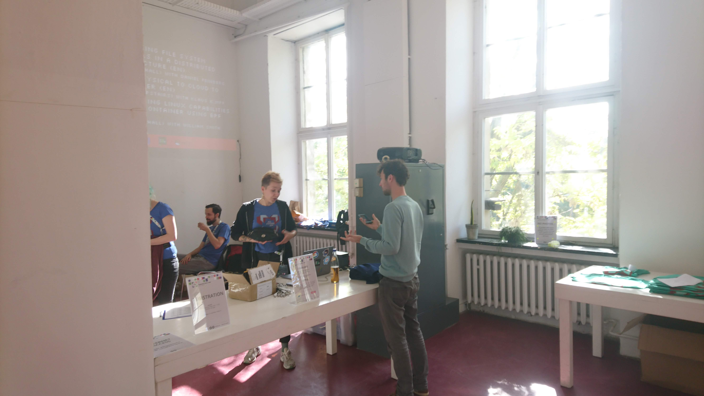
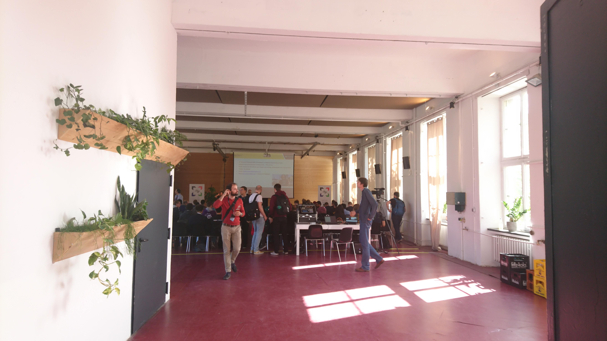
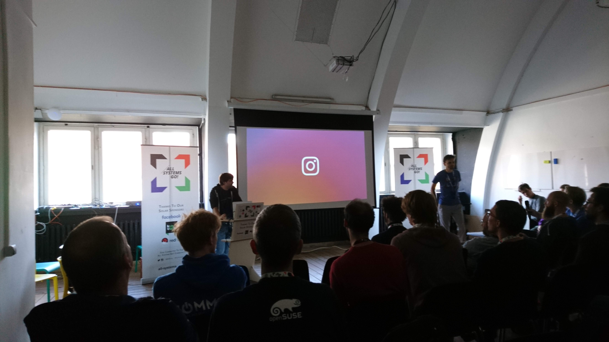
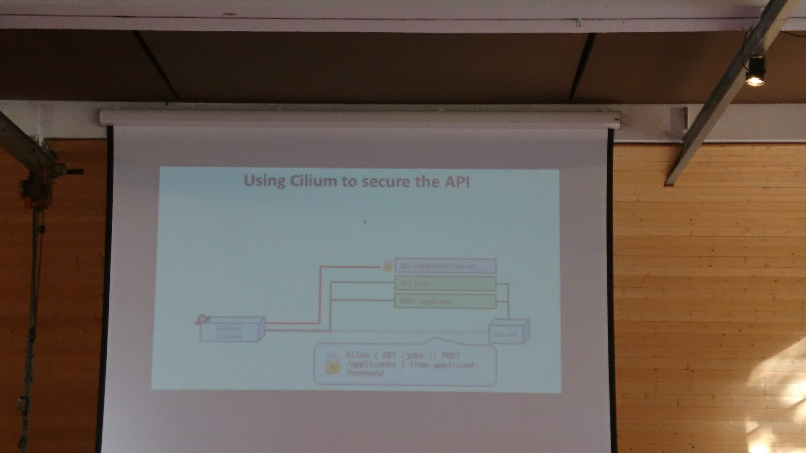
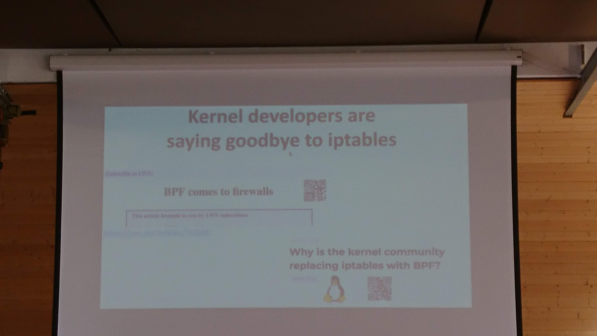
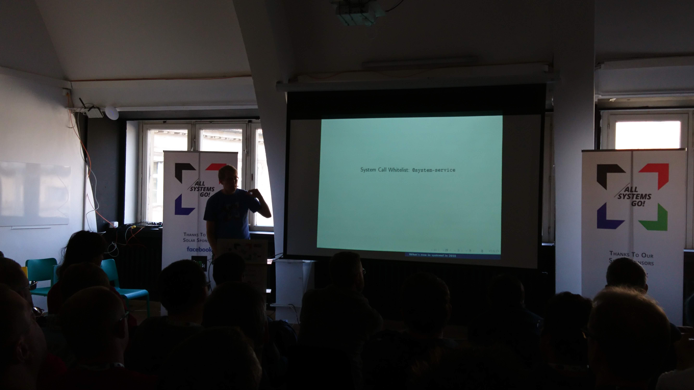

# All Systems Go Linux Conference

All Systems Go! is a conference focused on foundational user-space Linux
technologies. Its goal is to provide a gathering place for both contributors
and users of projects that make up the foundation of modern Linux systems.

## TOC

* [Friday](#friday-28-september)
    * [Functional resource control using cgroup2](#Functional-resource-control-using-cgroup2)
    * [From physical to cloud to container One system to manage them all](#From-physical-to-cloud-to-container-One-system-to-manage-them-all)
    * [Playing with casync @Instagram](#Playing-with-casync-@Instagram)
    * [Fluent Bit: Solving Logging Challenges for Cloud Native Environments](#Fluent-Bit-Solving-Logging-Challenges-for-Cloud-Native-Environments)
    * [Cilium Bringing the BPF Revolution to Kubernetes Networking and Security](#Cilium-Bringing-the-BPF-Revolution-to-Kubernetes-Networking-and-Security)
    * [Container Run times and Fun times](#Container-Run-times-and-Fun-times)
    * [Portable Services are Ready to Use](#Portable-Services-are-Ready-to-Use)
    * [Is my system fast?](#Is-my-system-fast?)

# Friday 28 September

## Functional resource control using cgroup2

> Tejun Heo, Johannes Weiner @Facebook

The idea to create transparent reource restriction for processes so that memory
leaks will not bring system down.

### Issues
* .high and .max aren't work conserving
* OOM killer doesn't protect workload health
* no good io controller to use
* `mmap_sem` and readahead

### Solutions
* memory.low and memory.min, liftu up, don't push down
* PSI resource pressure metric, system wide and per-cgroup if i had more of
  this resource i might have been able to run this percentage faster
* oomd - the gentler and more perceptive grim reaper helps kernet when resource
  isolation breaks down, workload QoS, context-aware decisions and actions
* io.latency - completion latency based IO control can be used both on hard
  disks and SSGs, works on `blk-mq`
* switch to btrfs to avoid ext4 journaling issues

### Setup
* switch to btrfs, multi-100k machines running it
* if there's no swap all anon memory is memcached
* enabled everywhere except for the main workload
* slice applications into:
    *  host critical (ssh, journald, rsyslog)
    * workload
    * system

### Results

Memory protections work much better than OOM killer

IO protections work slightly better on HDDs but much better on SSDs

Full OS resource isolation, proportion IO control for complex workloads

http://opensource.fb.com/#linux

## From physical to cloud to container One system to manage them all

> Klaus Kampf @SUSE

As a sys-admin i want to 
 * manage ny infra
 * provision systems
 * build the right artifacts

 Uyuni, Suse Manager is an answer to Red Hat Satellite Is an opnionated branch
 of Spacewalk
 * simple installation
 * salt configuration
 * container/kubernetes integration

Supports physical, PXE Boot (redfish planned), IPMI supported

Supports openstack, VMware, public cloud

https://github.com/uyuni-project/uyuni

## Playing with casync @Instagram

Why?  To deploy every commit from master to production.

CAPKG - package definition, manifest, store.

Allows to save lots of space, network traffic.
https://github.com/systemd/casync

Not using docker because of lots of deploys and overhead that it brings.

## Fluent Bit Solving Logging Challenges for Cloud Native Environments

> Eduardo Silva

Operational perspective
* discover logs

logging context matters in big container clusters; labels, annotations,
namespaces;

Written in C, low memory and CPU footprint, pluggable architecture, built-in
security with TLS.

Has input pligins, filter plugins.  Data is seralized with MessagePack.  Event
loop design, coroutines lus scripting, oauth support, special annotations for
k8s

https://github.com/fluent/fluent-bit

## Cilium Bringing the BPF Revolution to Kubernetes Networking and Security

> Thomas Graf

BPF gives an ability to extend a kernel/system call with a program.  eBPF -
extended BPF BPFd poverful linux tracing remote targets tool by google BPF/XDP
10x performance over IPVS, project from facebook available katran

Funny quote about iptables
>OH: "In any team you need a tank, a healer, a damage dealer, someone with
>crowd control abilities, and another who knows iptables"

cilium a local agent that generates a BPF program and attach it to pod.
Mode 1: encapsulation, Mode 2 direct routing

BPF-based - per-CPU hash table

Identity based security, embedding tokens in packets

https://cilium.io/

## Container Run times and Fun times

> Lindsay Salisbury @facebook

Using systemd inside a container

Tupperware, custom built container system

dbus > systemd replaces spawn/bash invocations

systemd-nspawn used for btrfs image building?

* contract for defining services
* interface for interacting with kernel abstraction
* oderly startup/shutdown
* flexible service composition

services defined as individual self-contained components, bind mounted into
container FS

Package with systemd units, metadata and service files. Kind of SDK for devs.
Kind of SDK for devs.

Secrets are managed with agent that controls applications.

## Portable Services are Ready to Use

> Lennart Poettering

Portable services: resource bundle + integration + sandboxing

Goal of portable services is to **leave no artifacts**.  Goal: fell like a
native service.  "Superprivilege containers"

Systemd now supports 3 formats: sysv, native, portable service.

Images for services, like `RootImage=`.

Image requires systemd unit files and `/var/lib/os-release`

Custom image format, dynamic users, d-bus usage.

`portablectl` new tool.  Profiles: default, strict, trusted, nonetwork.

Build tool: `mkosi`

## Is my system fast?

> Frank Becker @Amazon

Computer systems are complex. Most software applications are distributed and
expected to scale. That does not make them any simpler. Further, there is the
real world all of that is expected to work in. To analyze performance of such a
system isn't less complex. Luckily, there is help. The Open Source universe is
full of excellent tools that can help. The talk introduces a few of them.

The talk walks down the path of comparing two Linux servers that look pretty
much the same from the specs. Introducing test-tools like stress-ng, sysjitter,
fio, packetdrill, and friends it is shown how to get a good overview of the
systems CPU, memory, disk, and network performance.

Since benchmark results are usually time variant a few basic statistical terms
are refreshed and used for visualizing those results employing different chart
types.

The field of performance analysis is wide. There isn't more time in 45 minutes
than just to scratch the surface. At the end of the talk the audience will have
a few pointers of how to start evaluating their own Linux systems to provide
the right performance for their applications.

CPU, Memory, Disk IO, Network

Median is more robust than mean and should be less favorable.

Beware to not measure cached latency.

Book to read: Systems Performance - Brendan Gregg

Heatmap chart types, flame graphs.

CPU benchmark, SpecCPU, stress-ng.

Disk metrics: latency, throughput, queue depth, iops. fio tool to measure disk
io.

Network performance:
* transmit/receive
* throughput
* latency

CPU jitter - Sloarflare sysjitter

